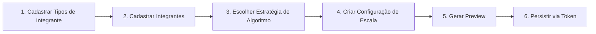
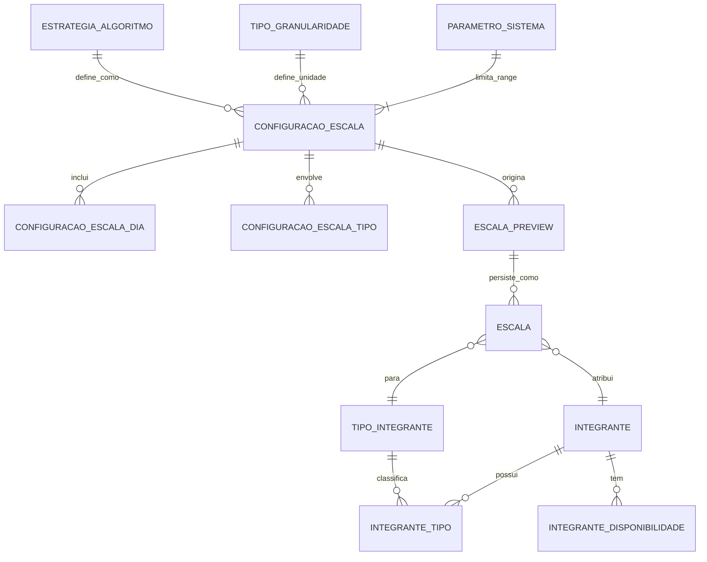
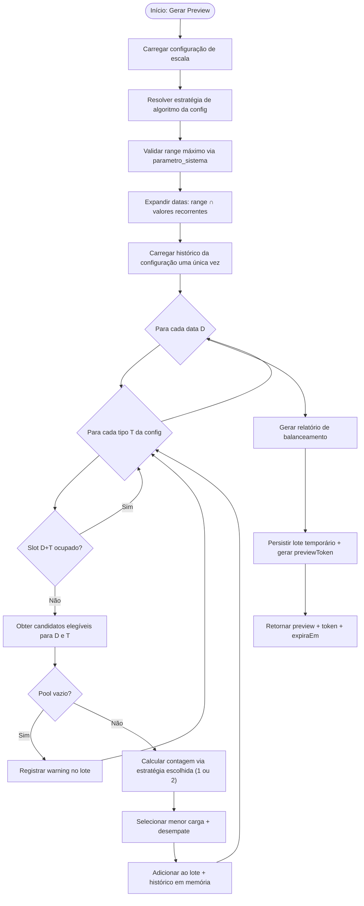

# PRD — EscalaApi (Plataforma Genérica de Escalas)

| Campo | Valor |
|-------|-------|
| **Versão** | 1.1 |
| **Data** | 06/07/2026 |
| **Status** | Rascunho para implementação |
| **Produto** | EscalaApi — API de geração e gestão de escalas |
| **Autor** | Felipe |

---

## Changelog

| Versão | Data | Alteração |
|--------|------|-----------|
| 1.0 | 05/07/2026 | Versão inicial |
| 1.1 | 06/07/2026 | Adicionado: catálogo de estratégias de algoritmo selecionável; preview com token de persistência; range máximo de datas configurável; tipo de granularidade temporal extensível |

---

## Sumário

1. [Resumo executivo](#1-resumo-executivo)
2. [Visão e objetivos](#2-visão-e-objetivos)
3. [Problema](#3-problema)
4. [Escopo](#4-escopo)
5. [Personas e casos de uso](#5-personas-e-casos-de-uso)
6. [Princípios de produto](#6-princípios-de-produto)
7. [Fluxo de onboarding e dependências](#7-fluxo-de-onboarding-e-dependências)
8. [Requisitos funcionais](#8-requisitos-funcionais)
9. [Configuração de escala](#9-configuração-de-escala)
   - 9.1 Conceito
   - 9.2 Exemplo
   - 9.3 Comportamento
   - 9.4 Relação com geração e preview
   - 9.5 Estratégia de algoritmo vinculada
   - 9.6 Range máximo de datas configurável
   - 9.7 Tipo de granularidade temporal
10. [Estratégias de algoritmo de rotação](#10-estratégias-de-algoritmo-de-rotação)
    - 10.1 Catálogo de estratégias
    - 10.2 Regras de uso e imutabilidade
    - 10.3 Estratégia 1 — Contextual por dia da semana
    - 10.4 Estratégia 2 — Contagem global
    - 10.5 Fluxo genérico de execução
    - 10.6 Desempate
    - 10.7 Exemplo completo (Estratégia 1 vs 2)
    - 10.8 Relatório de balanceamento
    - 10.9 Pseudocódigo e estrutura de classes
11. [Modelo de dados](#11-modelo-de-dados)
12. [Contratos de API](#12-contratos-de-api)
13. [Regras de negócio consolidadas](#13-regras-de-negócio-consolidadas)
14. [Melhorias técnicas herdadas da análise anterior](#14-melhorias-técnicas-herdadas-da-análise-anterior)
15. [Arquitetura de software proposta](#15-arquitetura-de-software-proposta)
16. [Requisitos não-funcionais](#16-requisitos-não-funcionais)
17. [Migração do estado atual](#17-migração-do-estado-atual)
18. [Critérios de aceite](#18-critérios-de-aceite)
19. [Roadmap sugerido](#19-roadmap-sugerido)
20. [Riscos e mitigações](#20-riscos-e-mitigações)
21. [Métricas de sucesso](#21-métricas-de-sucesso)
22. [Glossário](#22-glossário)
23. [Apêndices](#23-apêndices)

---

## 1. Resumo executivo

A **EscalaApi** deixará de ser um sistema voltado a escalas musicais e passará a ser uma **plataforma genérica de gestão e geração automática de escalas**, aplicável a qualquer contexto: igrejas, plantões hospitalares, turnos de suporte, equipes de eventos, voluntariado etc.

O usuário define **quais são os tipos de integrantes** (papéis/funções) antes de usar qualquer outra funcionalidade. Em seguida, cadastra integrantes, informa disponibilidade e configura **como a escala funciona** — incluindo o **período máximo permitido** (configurável no banco), a **estratégia de algoritmo de rotação** escolhida e o **tipo de granularidade temporal** (dias da semana por padrão; horas do dia no futuro).

O sistema gera atribuições em **modo preview**, retornando um token que permite persistir exatamente o que foi exibido — com suporte futuro a ajustes manuais no frontend antes de salvar. Cada configuração de escala fica vinculada a uma única estratégia de algoritmo, garantindo que não haja mistura de critérios de equidade dentro do mesmo ciclo.

Este PRD consolida as decisões de produto v1.1, a especificação dos algoritmos, melhorias técnicas identificadas na análise do código atual e o plano de evolução da arquitetura.

---

## 2. Visão e objetivos

### 2.1 Visão

Ser a API de referência para equipes que precisam distribuir responsabilidades recorrentes de forma transparente, configurável e justa — sem depender de planilhas manuais ou conhecimento de domínio específico.

### 2.2 Objetivos de produto

| # | Objetivo | Indicador |
|---|----------|-----------|
| O1 | Generalizar o domínio (tipos definidos pelo usuário) | Zero referências hardcoded a instrumentos musicais |
| O2 | Garantir ordem correta de configuração | Bloqueio claro quando tipos não estão cadastrados |
| O3 | Permitir configurar o padrão temporal da escala | Usuário define range + granularidade + dias antes de gerar |
| O4 | Rotacionar integrantes de forma justa | Desvio máximo de 1 escala entre pares comparáveis |
| O5 | Oferecer múltiplas estratégias de algoritmo | Catálogo extensível; escolha imutável por configuração |
| O6 | Preview confiável e persistível | Token de preview permite salvar exatamente o que foi exibido |
| O7 | Tornar o algoritmo auditável | Código legível + documentação + testes |

### 2.3 Objetivos fora de escopo (Non-Goals) — v1

- Interface web ou mobile (apenas API REST).
- Multi-tenancy / múltiplas organizações na mesma instância.
- Autenticação e autorização (RBAC) — previsto para v2.
- Notificações (e-mail, WhatsApp, push).
- Otimização combinatória avançada (solver de programação linear).
- Granularidade por horas do dia (previsto para v1.2 — infraestrutura criada, funcionalidade desabilitada).
- Regras de consecutividade configuráveis — previsto para v1.1.

---

## 3. Problema

### 3.1 Situação atual

O sistema existente:

- Possui tipos de escala **fixos no seed do banco** (Ministro, Bateria, Teclado…).
- Implementa um algoritmo de "menor contagem histórica por tipo" com desempate aleatório, concentrado em um único método monolítico (`EscalaManagerService.CriarEscala`).
- Conta escalas de forma **global por integrante + tipo**, sem distinguir o dia da semana — penalizando injustamente quem tem mais dias disponíveis.
- Não possui entidade explícita de **configuração de escala**.
- Não oferece escolha de estratégia de rotação.
- Não possui testes automatizados de equidade.
- Preview não retorna token; não há como persistir um preview específico depois.

### 3.2 Dores do usuário

> **Dor 1 (equidade contextual):** "João está disponível quarta e domingo; Maria só domingo. João foi escalado 2 vezes (1 quarta + 1 domingo) e Maria 1 vez (domingo). Na próxima escala de domingo, Maria não deveria ter prioridade sobre João — a comparação deve ser feita **no contexto do domingo**, onde ambos têm a mesma oportunidade."

> **Dor 2 (equidade global):** "Em outros contextos, quero que quem foi escalado mais vezes no total espere mais, independente de qual dia foi. A disponibilidade não deve ser desculpa para alguém nunca ser penalizado."

> **Dor 3 (preview frágil):** "Gerei uma preview, mostrei para o líder, ele aprovou — mas quando fui salvar, gerou de novo e saiu diferente."

> **Dor 4 (range sem controle):** "Alguém gerou uma escala de 2 anos acidentalmente e sobrecarregou o banco."

### 3.3 Oportunidade

Generalizar o produto, oferecer estratégias de rotação escolhíveis e garantir um fluxo de preview → persistência seguro torna a plataforma aplicável a uma amplitude de casos de uso muito maior.

---

## 4. Escopo

### 4.1 Dentro do escopo (v1.1)

| Módulo | Descrição |
|--------|-----------|
| **Tipos de integrante** | CRUD completo; pré-requisito para demais módulos |
| **Integrantes** | CRUD com tipos e disponibilidade |
| **Estratégias de algoritmo** | Catálogo no banco; 2 estratégias implementadas em v1 |
| **Parâmetros do sistema** | Range máximo de datas configurável no banco |
| **Tipo de granularidade temporal** | Tabela extensível; apenas `dias_semana` ativo em v1 |
| **Configuração de escala** | Vincula range, estratégia, granularidade e tipos |
| **Geração com preview token** | Preview retorna token; token permite persistir |
| **Consulta e edição manual** | Listar, obter por ID, editar atribuição individual |
| **Importação CSV genérica** | Colunas dinâmicas baseadas nos tipos cadastrados |
| **Documentação** | PRD, spec do algoritmo, Swagger atualizado |

### 4.2 Fora do escopo (v1.1)

- Frontend.
- Autenticação.
- Granularidade por horas do dia (infraestrutura criada, funcionalidade bloqueada).
- Estratégia 3+ de algoritmo (extensível, mas não implementada).
- Histórico de auditoria de alterações manuais.
- Exportação PDF/impressão.

---

## 5. Personas e casos de uso

### 5.1 Personas

| Persona | Descrição | Necessidade principal |
|---------|-----------|----------------------|
| **Administrador da escala** | Líder de equipe/voluntariado | Configurar tipos, escolher estratégia, gerar escala justa |
| **Integrante** | Pessoa escalada | Ver quando está de plantão (via sistema externo futuro) |
| **Desenvolvedor integrador** | Consome a API | Contratos estáveis, preview seguro, erros claros |

### 5.2 Casos de uso principais

```
UC-01  Cadastrar tipos de integrante
UC-02  Cadastrar integrante com tipos e disponibilidade
UC-03  Consultar estratégias de algoritmo disponíveis
UC-04  Consultar parâmetros do sistema (range máximo)
UC-05  Criar configuração de escala (vincula estratégia, granularidade, range, tipos)
UC-06  Gerar preview de escala (retorna token)
UC-07  Persistir preview via token
UC-08  Editar atribuição manualmente
UC-09  Importar escala via CSV genérico
UC-10  Consultar escalas por período/tipo/integrante
UC-11  Recriar configuração com nova estratégia a partir da data atual
```

---

## 6. Princípios de produto

1. **Configuração antes de execução** — tipos de integrante são a fundação; nada funciona sem eles.
2. **Estratégia imutável por ciclo** — uma vez que escalas foram persistidas com uma estratégia, ela não pode ser trocada retroativamente naquela configuração.
3. **Preview confiável** — o token garante que o que o usuário viu é exatamente o que será salvo.
4. **Justiça explícita e escolhível** — o critério de equidade é transparente, documentado e selecionado conscientemente pelo usuário.
5. **Domínio agnóstico** — nomenclatura e dados não assumem contexto musical.
6. **Extensibilidade segura** — granularidade temporal e estratégias de algoritmo têm infraestrutura para crescer sem breaking changes.
7. **Falha explícita** — slot sem candidato elegível gera aviso, não silêncio.

---

## 7. Fluxo de onboarding e dependências

### 7.1 Ordem obrigatória de configuração



### 7.2 Regras de bloqueio (gatekeeping)

| Ação | Pré-requisito | Resposta se não atendido |
|------|---------------|--------------------------|
| POST `/integrantes` | ≥ 1 tipo de integrante cadastrado | `422` — "Cadastre ao menos um tipo de integrante antes de prosseguir" |
| POST `/configuracoes-escala` | ≥ 1 tipo + ≥ 1 integrante + estratégia válida | `422` — mensagem específica |
| POST `/escalas/gerar` | Configuração válida + integrantes elegíveis | `422` com detalhes |
| POST `/escalas/preview/{token}/persistir` | Token válido e não expirado | `404` / `410 Gone` |
| POST `/escalas/import-csv` | Tipos cadastrados correspondentes às colunas | `400` com colunas inválidas listadas |

### 7.3 Diagrama de dependências de entidades



---

## 8. Requisitos funcionais

### RF-01 — Tipos de integrante (CRUD)

| ID | Requisito | Prioridade |
|----|-----------|------------|
| RF-01.1 | Criar tipo com `nome` (obrigatório, único, 2–100 chars) e `descricao` (opcional) | Must |
| RF-01.2 | Listar, obter por ID, atualizar e excluir (soft delete preferível) | Must |
| RF-01.3 | Impedir exclusão se houver integrantes ou escalas vinculadas | Must |
| RF-01.4 | `GET /tipos-integrante/existe` retorna boolean para gatekeeping | Should |
| RF-01.5 | Remover seed hardcoded de tipos musicais do `init.sql` | Must |

**Renomeação de domínio:** `tipo_escala` → **`tipo_integrante`**. A tabela `escalas.cd_tipo_escala` passa a referenciar `tipo_integrante.id`.

---

### RF-02 — Integrantes

| ID | Requisito | Prioridade |
|----|-----------|------------|
| RF-02.1 | CRUD de integrante com `nome` | Must |
| RF-02.2 | Associar um ou mais `tipo_integrante_id` | Must |
| RF-02.3 | Associar um ou mais dias de disponibilidade (`DayOfWeek`) | Must |
| RF-02.4 | Validar que tipos informados existem | Must |
| RF-02.5 | Validar que disponibilidade tem ≥ 1 dia | Must |
| RF-02.6 | Disponibilidade deve ser subconjunto dos dias da configuração (warning, não bloqueio) | Should |

---

### RF-03 — Estratégias de algoritmo (somente leitura em v1)

| ID | Requisito | Prioridade |
|----|-----------|------------|
| RF-03.1 | `GET /estrategias-algoritmo` lista estratégias ativas com nome e descrição detalhada | Must |
| RF-03.2 | `GET /estrategias-algoritmo/{id}` retorna estratégia por ID | Must |
| RF-03.3 | Estratégias são cadastradas via seed/migration, não por endpoint de criação em v1 | Must |
| RF-03.4 | Campo `fl_ativo` permite habilitar/desabilitar estratégias sem deletar | Should |

---

### RF-04 — Parâmetros do sistema

| ID | Requisito | Prioridade |
|----|-----------|------------|
| RF-04.1 | `GET /parametros` retorna configurações globais incluindo range máximo atual | Must |
| RF-04.2 | `PUT /parametros/range-maximo` atualiza o range máximo permitido | Must |
| RF-04.3 | Valor padrão em código quando nenhum parâmetro estiver setado: `mensal` | Must |
| RF-04.4 | Alteração do range máximo afeta apenas novas configurações de escala | Should |

---

### RF-05 — Configuração de escala

Ver [Seção 9](#9-configuração-de-escala).

---

### RF-06 — Geração de escala com preview token

| ID | Requisito | Prioridade |
|----|-----------|------------|
| RF-06.1 | `POST /escalas/gerar` retorna preview com `previewToken` e `expiraEm` | Must |
| RF-06.2 | Preview não persiste escalas; armazena lote temporário referenciado pelo token | Must |
| RF-06.3 | `POST /escalas/preview/{token}/persistir` grava exatamente o lote do preview | Must |
| RF-06.4 | Token expirado retorna `410 Gone` com mensagem descritiva | Must |
| RF-06.5 | Gerar novo preview para mesma configuração invalida tokens anteriores | Should |
| RF-06.6 | Preview inclui relatório de balanceamento e warnings | Must |
| RF-06.7 | Pular slots já preenchidos (escala manual ou importada) | Must |
| RF-06.8 | Impedir mesma pessoa em múltiplos tipos no mesmo dia (configurável, default: bloquear) | Should |

---

### RF-07 — Consulta e edição

| ID | Requisito | Prioridade |
|----|-----------|------------|
| RF-07.1 | Listar escalas com filtros: período, tipo, integrante, configuração | Must |
| RF-07.2 | Obter escala por ID | Must |
| RF-07.3 | Editar atribuição manual (integrante, tipo, data) | Must |
| RF-07.4 | Paginação consistente (`skip`, `take`) | Must |

---

### RF-08 — Importação CSV genérica

| ID | Requisito | Prioridade |
|----|-----------|------------|
| RF-08.1 | Coluna obrigatória: `Data` (formato `dd/MM/yyyy`) | Must |
| RF-08.2 | Demais colunas mapeadas dinamicamente para tipos cadastrados (header = nome do tipo) | Must |
| RF-08.3 | Opção `substituirExistentes` mantida | Must |
| RF-08.4 | Validar nomes de integrantes e tipos; reportar linhas com erro | Must |

---

## 9. Configuração de escala

### 9.1 Conceito

Uma **Configuração de Escala** descreve **como** a escala funciona antes de executar o algoritmo. Ela responde:

- **Quando?** — `data_inicio` e `data_fim` dentro do range máximo permitido.
- **Quais unidades temporais?** — definido pelo `tipo_granularidade` (ex.: dias da semana).
- **Quais valores?** — ex.: `[Quarta, Domingo]` para granularidade `dias_semana`.
- **Quais papéis?** — ex.: `[Recepcionista, Ministrante]`.
- **Qual algoritmo?** — `id_estrategia_algoritmo` vinculado.
- **Nome identificador** — ex.: "Escala culto 2026 — Q1".

### 9.2 Exemplo

```json
{
  "nome": "Plantão suporte — Jan-Mar 2026",
  "dataInicio": "2026-01-01",
  "dataFim": "2026-03-31",
  "idTipoGranularidade": 1,
  "valoresRecorrentes": ["Quarta", "Domingo"],
  "tiposIntegrante": [1, 3, 5],
  "idEstrategiaAlgoritmo": 1,
  "ativo": true
}
```

**Datas efetivas geradas:** todos os dias entre 01/01/2026 e 31/03/2026 cujo `DayOfWeek` seja Quarta ou Domingo.

### 9.3 Comportamento

| Regra | Descrição |
|-------|-----------|
| Validação de range | `data_inicio <= data_fim` e `data_fim - data_inicio ≤ range_maximo_sistema` |
| Valores recorrentes | Lista não vazia, sem duplicatas, válidos para o tipo de granularidade |
| Interseção com disponibilidade | Integrante só entra no pool se disponível naquele slot |
| Reutilização | Mesma configuração pode gerar preview múltiplas vezes |
| Imutabilidade de estratégia | Após escalas persistidas via token, estratégia não pode ser alterada nessa config |
| Mudança de estratégia | Criar nova configuração a partir da data atual com nova estratégia |

### 9.4 Relação com geração e preview

```
// Passo 1 — Gerar preview
POST /escalas/gerar
{
  "configuracaoEscalaId": 42,
  "impedirMultiplosTiposMesmoDia": true
}

// Resposta:
{
  "previewToken": "eyJhbGciOiJIUzI1NiJ9...",
  "expiraEm": "2026-01-07T03:00:00Z",
  "escalas": [ "...atribuições..." ],
  "balanceamento": [ "..." ],
  "warnings": [ "..." ]
}

// Passo 2 — Persistir o preview exibido
POST /escalas/preview/{token}/persistir
```

O algoritmo **não recebe** `DataInicio`, `DataFim`, `DiasDaSemana` e `TipoEscala` soltos — tudo vem da configuração.

### 9.5 Estratégia de algoritmo vinculada

A `configuracao_escala` referencia `id_estrategia_algoritmo`, que determina **como os integrantes são comparados** no momento da seleção. Ver [Seção 10](#10-estratégias-de-algoritmo-de-rotação) para detalhes de cada estratégia.

**Regra de imutabilidade:** uma vez que pelo menos uma escala foi persistida a partir dessa configuração (via token), o campo `id_estrategia_algoritmo` torna-se somente leitura. Tentativas de alteração retornam `409 Conflict` com:

```json
{
  "erro": "EstrategiaImutavel",
  "mensagem": "Esta configuração já possui escalas persistidas. Para usar outra estratégia, crie uma nova configuração a partir de hoje.",
  "sugestao": {
    "dataInicio": "2026-07-06",
    "configuracaoBaseId": 42
  }
}
```

### 9.6 Range máximo de datas configurável

O sistema possui uma tabela `parametro_sistema` com o range máximo permitido para `data_fim - data_inicio`. O valor padrão em código é **`mensal`** (31 dias), caso nenhum parâmetro esteja cadastrado.

| Código | Descrição | Dias máximos |
|--------|-----------|--------------|
| `semanal` | 1 semana | 7 |
| `mensal` | 1 mês (default) | 31 |
| `trimestral` | 3 meses | 92 |
| `semestral` | 6 meses | 184 |
| `anual` | 1 ano | 365 |
| `ilimitado` | Sem limite | — |

O parâmetro é alterável via `PUT /parametros/range-maximo` e entra em vigor apenas para **novas** configurações de escala criadas após a alteração.

Ao tentar criar uma `configuracao_escala` com range maior que o permitido:
```json
{
  "erro": "RangeExcedido",
  "mensagem": "O intervalo informado (92 dias) excede o máximo configurado para mensal (31 dias).",
  "rangeMaximoAtual": "mensal",
  "diasPermitidos": 31
}
```

### 9.7 Tipo de granularidade temporal

Define a **unidade de tempo** usada para expressar quando a escala ocorre. A tabela `tipo_granularidade` é extensível; apenas o tipo `dias_semana` está ativo em v1.

| ID | Código | Descrição | Status v1 |
|----|--------|-----------|-----------|
| 1 | `dias_semana` | Dias da semana (Seg–Dom), 7 opções | **Ativo** |
| 2 | `horas_dia` | Horas fixas (00:00–23:59) ou períodos isolados | Desabilitado (infraestrutura criada) |

**Por padrão em código:** se `idTipoGranularidade` não for informado, assume `1 (dias_semana)`.

**Comportamento para tipo não ativo:**

```json
{
  "erro": "GranularidadeNaoSuportada",
  "mensagem": "O tipo de granularidade 'horas_dia' ainda não está disponível. Utilize 'dias_semana' (id=1)."
}
```

**Extensibilidade:** ao habilitar `horas_dia` no futuro, `configuracao_escala_slot` substituirá `configuracao_escala_dia` para suportar tanto dias quanto horários — sem alterar os contratos de granularidade `dias_semana` existentes.

---

## 10. Estratégias de algoritmo de rotação

### 10.1 Catálogo de estratégias

A tabela `estrategia_algoritmo` define os algoritmos disponíveis. Novas estratégias são adicionadas via migration sem breaking changes na API.

| ID | Código | Nome | Descrição resumida | Status v1 |
|----|--------|------|--------------------|-----------|
| 1 | `contextual_dia_semana` | Contextual por dia da semana | Compara integrantes apenas dentro do mesmo dia da semana e tipo | **Ativo** |
| 2 | `global` | Contagem global | Compara pelo total de escalas do integrante naquele tipo, independente do dia | **Ativo** |

A descrição completa de cada estratégia (o "como funciona" detalhado) é armazenada na coluna `txt_descricao_detalhada` da tabela e também exposta via `GET /estrategias-algoritmo/{id}`.

### 10.2 Regras de uso e imutabilidade

1. **Escolha consciente:** o usuário seleciona a estratégia ao criar a `configuracao_escala`, consultando previamente `GET /estrategias-algoritmo` para entender as diferenças.
2. **Uma estratégia por configuração:** não há mix. Toda a geração daquela configuração usa a mesma lógica.
3. **Imutabilidade pós-persistência:** após a primeira escala persistida via token nessa configuração, `id_estrategia_algoritmo` é bloqueado para edição.
4. **Troca de estratégia:** criar nova configuração com `data_inicio = hoje`, referenciando a configuração anterior como base (opcional). O histórico antigo continua no banco, mas a nova configuração parte do zero para fins de contagem.
5. **Histórico de contagem:** cada estratégia usa o histórico das escalas da **mesma configuração** para calcular carga — não escalas de configurações diferentes ou importadas via CSV.

> **Justificativa da regra 5:** misturar contagens de configurações com estratégias diferentes geraria distorções. Escalas de outras fontes (CSV, manual) são preservadas como registros históricos, mas não entram no cálculo de equidade da geração automática.

### 10.3 Estratégia 1 — Contextual por dia da semana (`contextual_dia_semana`)

#### Princípio

A justiça é calculada no contexto **`(tipo_integrante, dia_da_semana)`**, não pelo total global de escalas do integrante.

> **Regra central:** ao selecionar integrante para uma escala de **Domingo**, comparar apenas quantas vezes cada candidato foi escalado em **Domingos** daquele **tipo** — ignorando escalas em outros dias da semana.

#### Quando usar

- Quando os integrantes têm disponibilidades muito diferentes entre si (alguns disponíveis para muitos dias, outros para poucos).
- Quando se considera injusto penalizar alguém por ter sido escalado em um dia em que o outro simplesmente não poderia participar.
- Contextos: escalas de culto/reunião, onde o mesmo integrante tem papéis em dias diferentes.

#### Definições formais

```
Contexto(C) = (tipo_integrante_id, day_of_week)

Candidatos(C, data) = {
  integrante |
    tipo_integrante_id ∈ tipos_do_integrante
    AND day_of_week(data) ∈ disponibilidade_do_integrante
    AND integrante não escalado em outro tipo na mesma data (se regra ativa)
}

Contagem(integrante, C) = |{
  escala e |
    e.integrante = integrante
    AND e.tipo = C.tipo
    AND day_of_week(e.data) = C.dia
    AND e.configuracao = configuracao_atual
    AND e.data ∈ histórico ∪ lote_atual
}|

Selecionar(C, data):
  pool ← Candidatos(C, data)
  se pool vazio → warning, retornar null
  min ← min(Contagem(i, C) para i ∈ pool)
  empatados ← { i ∈ pool | Contagem(i, C) = min }
  retornar Desempatar(empatados)
```

### 10.4 Estratégia 2 — Contagem global (`global`)

#### Princípio

A justiça é calculada pelo **total de escalas** do integrante naquele tipo, **independente do dia da semana**. Quem foi escalado mais vezes no total espera mais, mesmo que as escalas extras tenham sido em dias em que o outro não estava disponível.

> **Regra central:** ao selecionar integrante para uma escala de **Domingo**, comparar o total de vezes que cada candidato foi escalado naquele tipo — incluindo escalas de outros dias.

#### Quando usar

- Quando se quer minimizar a carga total de qualquer integrante, independente do contexto.
- Quando a equipe entende que "estar disponível para mais dias é uma escolha do integrante" e deve implicar mais escalas.
- Contextos: plantões de suporte, onde o esforço total por pessoa é o critério de equidade.

#### Definições formais

```
Contagem(integrante, tipo) = |{
  escala e |
    e.integrante = integrante
    AND e.tipo = tipo
    AND e.configuracao = configuracao_atual
    AND e.data ∈ histórico ∪ lote_atual
}|

Selecionar(tipo, data):
  pool ← Candidatos(tipo, data)
  se pool vazio → warning, retornar null
  min ← min(Contagem(i, tipo) para i ∈ pool)
  empatados ← { i ∈ pool | Contagem(i, tipo) = min }
  retornar Desempatar(empatados)
```

#### Contraste com Estratégia 1

| Situação | Estratégia 1 (contextual) | Estratégia 2 (global) |
|----------|--------------------------|----------------------|
| João: 1 Qua + 1 Dom | Domingo: contagem = 1 | Domingo: contagem = 2 |
| Maria: 1 Dom | Domingo: contagem = 1 | Domingo: contagem = 1 |
| Próximo domingo | **Empate** → desempate | **Maria é favorecida** (1 < 2) |

### 10.5 Fluxo genérico de execução

O fluxo abaixo é independente da estratégia escolhida; a diferença está na implementação de `CalcularContagem`:



**Separação de responsabilidade:**

- `ExpansorDeDatas` — converte range + granularidade em lista de datas.
- `CalculadorDeCarga` — encapsula a lógica de contagem; recebe a estratégia como parâmetro.
- `SeletorDeIntegrante` — chama `CalculadorDeCarga` e aplica o desempate.
- `GeradorDePreview` — orquestra, monta lote, gera token.
- `PersistidorDePreview` — recebe token, valida, persiste o lote armazenado.

### 10.6 Desempate (determinístico para ambas as estratégias)

| Prioridade | Critério | Motivo |
|------------|----------|--------|
| 1 | Menor contagem (conforme estratégia) | Justiça principal |
| 2 | Data mais antiga da última escala no mesmo tipo (quem foi escalado há mais tempo) | Rotação previsível |
| 3 | Menor `id_integrante` | Determinismo total para testes |

> Eliminar `new Random()` por iteração. Desempate auditável. Opção futura de `modoDesempate: "aleatorio"` na configuração.

### 10.7 Exemplo completo: Estratégia 1 vs 2 (cenário João/Maria)

**Configuração:** Semanas 1–2 de janeiro, dias [Qua, Dom], tipo "Recepcionista".

| Integrante | Disponibilidade |
|------------|-----------------|
| João | Qua, Dom |
| Maria | Dom |

**Semana 1 — Qua 07/01:**
- Estratégia 1 contexto (Rec, Qua): João=0 → **João**
- Estratégia 2 total (Rec): João=0 → **João**

**Semana 1 — Dom 11/01:**
- Estratégia 1 contexto (Rec, Dom): João=0, Maria=0 → empate → **João** (id menor)
- Estratégia 2 total (Rec): João=1, Maria=0 → **Maria**

**Semana 2 — Qua 14/01:**
- Estratégia 1: João=1 (1 qua) → **João** (único)
- Estratégia 2: João=2 → **João** (único)

**Semana 2 — Dom 18/01:**
- Estratégia 1 contexto (Rec, Dom): João=1 (1 dom), Maria=1 (1 dom) → empate → desempate por última escala: Maria escalada no Dom 11/01, João no Dom 11/01... mesma data → **João** (id menor)
- Estratégia 2 total (Rec): João=3, Maria=1 → **Maria**

**Conclusão para 4 domingos:**
- Estratégia 1: João 2 domingos, Maria 2 domingos → equilíbrio contextual.
- Estratégia 2: João ≈ 1 domingo (escalado mais nas quartas), Maria ≈ 3 domingos → equilíbrio total.

### 10.8 Relatório de balanceamento (resposta da API)

```json
{
  "previewToken": "abc123...",
  "expiraEm": "2026-01-07T03:00:00Z",
  "estrategiaUtilizada": {
    "id": 1,
    "codigo": "contextual_dia_semana",
    "nome": "Contextual por dia da semana"
  },
  "escalas": [ "...atribuições..." ],
  "balanceamento": [
    {
      "tipoIntegranteId": 1,
      "tipoIntegranteNome": "Recepcionista",
      "diaSemana": "Domingo",
      "contagens": [
        { "integranteId": 1, "nome": "João", "total": 2 },
        { "integranteId": 2, "nome": "Maria", "total": 2 }
      ],
      "desvioMaximo": 0
    },
    {
      "tipoIntegranteId": 1,
      "diaSemana": "Quarta",
      "contagens": [
        { "integranteId": 1, "nome": "João", "total": 4 }
      ],
      "desvioMaximo": 0
    }
  ],
  "warnings": [
    {
      "data": "2026-01-07",
      "tipoIntegranteId": 3,
      "mensagem": "Nenhum integrante elegível para tipo 'Intercessor' na Quarta-feira"
    }
  ]
}
```

### 10.9 Pseudocódigo e estrutura de classes

```csharp
// Namespace: EscalaApi.Services.Rotacao

public sealed class GeradorDePreview
{
    public async Task<ResultadoPreview> GerarAsync(ConfiguracaoEscala config)
    {
        var estrategia = _resolvedorEstrategia.Resolver(config.IdEstrategiaAlgoritmo);
        var datas = _expansorDeDatas.Expandir(config);
        var historico = await _escalaRepository.ObterHistoricoConfiguracao(config.Id);
        var lote = new LoteDeEscalas();

        foreach (var data in datas)
        foreach (var tipo in config.TiposIntegrante)
        {
            if (historico.JaOcupado(data, tipo) || lote.JaOcupado(data, tipo)) continue;

            var pool = _seletor.ObterCandidatos(tipo, data, lote);
            if (pool.Count == 0) { lote.AdicionarWarning(data, tipo); continue; }

            var contagens = _calculadorDeCarga.Calcular(estrategia, pool, tipo, data, historico, lote);
            var escolhido = _seletor.EscolherPorMenorCarga(contagens);
            lote.Adicionar(new Atribuicao(escolhido, data, tipo));
        }

        var token = await _tokenPreview.SalvarAsync(lote, config.Id);
        return ResultadoPreview.Criar(lote, token);
    }
}

// Estratégias implementam interface comum
public interface IEstrategiaContagem
{
    int Calcular(Integrante integrante, int tipoId, DateTime data,
                 IEnumerable<Escala> historico, LoteDeEscalas loteAtual);
}
```

| Classe / Interface | Responsabilidade |
|--------------------|------------------|
| `IExpansorDeDatas` | Range + granularidade → lista de datas |
| `IEstrategiaContagem` | Interface de estratégia; implementações: `ContextualPorDiaSemana`, `Global` |
| `IResolvedorEstrategia` | Resolve implementação pelo `id_estrategia_algoritmo` |
| `ISeletorDeIntegrante` | Pool de candidatos + desempate |
| `ICalculadorDeCarga` | Delega para estratégia escolhida |
| `ILoteDeEscalas` | Escalas do lote atual + warnings |
| `IGeradorDePreview` | Orquestração |
| `IPersistidorDePreview` | Valida token + persiste lote |
| `IRelatorioBalanceamento` | Métricas pós-geração |

---

## 11. Modelo de dados

### 11.1 Tabelas (estado alvo)

#### `estrategia_algoritmo` (NOVA)

| Coluna | Tipo | Restrições |
|--------|------|------------|
| `id_estrategia_algoritmo` | INT IDENTITY | PK |
| `codigo` | VARCHAR(50) | NOT NULL, UNIQUE |
| `txt_nome` | NVARCHAR(100) | NOT NULL |
| `txt_descricao_detalhada` | NVARCHAR(MAX) | NOT NULL |
| `fl_ativo` | BIT | NOT NULL, DEFAULT 1 |

**Seed obrigatório:**

```sql
INSERT INTO estrategia_algoritmo (codigo, txt_nome, txt_descricao_detalhada, fl_ativo) VALUES
(1, 'contextual_dia_semana', 'Contextual por dia da semana',
 'Compara integrantes apenas dentro do mesmo dia da semana e tipo. '
 'A escala de quarta de João não penaliza João na seleção de domingo. '
 'Indicado quando integrantes têm disponibilidades distintas e não se considera '
 'justo penalizar quem tem mais disponibilidade.', 1),
(2, 'global', 'Contagem global',
 'Compara pelo total de escalas do integrante naquele tipo, independente do dia. '
 'Quem foi escalado mais vezes no total espera mais na próxima seleção. '
 'Indicado quando a carga total por pessoa é o critério de equidade.', 1);
```

---

#### `tipo_granularidade` (NOVA)

| Coluna | Tipo | Restrições |
|--------|------|------------|
| `id_tipo_granularidade` | INT IDENTITY | PK |
| `codigo` | VARCHAR(50) | NOT NULL, UNIQUE |
| `txt_nome` | NVARCHAR(100) | NOT NULL |
| `txt_descricao` | NVARCHAR(500) | NULL |
| `fl_ativo` | BIT | NOT NULL, DEFAULT 1 |

**Seed:**

```sql
INSERT INTO tipo_granularidade (codigo, txt_nome, txt_descricao, fl_ativo) VALUES
(1, 'dias_semana', 'Dias da semana',
 'Escala organizada por dias da semana (Domingo a Sábado, 0–6).', 1),
(2, 'horas_dia', 'Horas do dia',
 'Escala organizada por horas ou períodos do dia (00:00–23:59). Reservado para versão futura.', 0);
```

---

#### `parametro_sistema` (NOVA)

| Coluna | Tipo | Restrições |
|--------|------|------------|
| `id_parametro` | INT IDENTITY | PK |
| `chave` | VARCHAR(100) | NOT NULL, UNIQUE |
| `valor` | NVARCHAR(200) | NOT NULL |
| `descricao` | NVARCHAR(500) | NULL |
| `dt_atualizacao` | DATETIME2 | NOT NULL, DEFAULT GETUTCDATE() |

**Seed:**

```sql
INSERT INTO parametro_sistema (chave, valor, descricao) VALUES
('range_maximo_escala', 'mensal',
 'Range máximo permitido para configurações de escala. '
 'Valores aceitos: semanal, mensal, trimestral, semestral, anual, ilimitado.');
```

---

#### `tipo_integrante` (substitui `tipo_escala`)

| Coluna | Tipo | Restrições |
|--------|------|------------|
| `id_tipo_integrante` | INT IDENTITY | PK |
| `desc_nome` | NVARCHAR(100) | NOT NULL, UNIQUE |
| `descricao` | NVARCHAR(500) | NULL |
| `dt_criacao` | DATETIME2 | NOT NULL, DEFAULT GETUTCDATE() |
| `fl_ativo` | BIT | NOT NULL, DEFAULT 1 |

---

#### `integrantes` (mantida, sem alteração estrutural)

---

#### `integrante_tipo` (renomear de `tipo_integrante` atual)

| Coluna | Tipo | Restrições |
|--------|------|------------|
| `id_integrante_tipo` | INT IDENTITY | PK |
| `id_integrante` | INT | FK → integrantes |
| `id_tipo_integrante` | INT | FK → tipo_integrante |
| | | UNIQUE(id_integrante, id_tipo_integrante) |

---

#### `integrante_disponibilidade` (renomear de `integrantes_dias_disponiveis`)

| Coluna | Tipo | Restrições |
|--------|------|------------|
| `id` | INT IDENTITY | PK |
| `id_integrante` | INT | FK |
| `cd_dia_semana` | INT | 0=Dom…6=Sáb |
| | | UNIQUE(id_integrante, cd_dia_semana) |

---

#### `configuracao_escala` (NOVA — evolução do request atual)

| Coluna | Tipo | Restrições |
|--------|------|------------|
| `id_configuracao` | INT IDENTITY | PK |
| `desc_nome` | NVARCHAR(200) | NOT NULL |
| `dt_inicio` | DATE | NOT NULL |
| `dt_fim` | DATE | NOT NULL |
| `id_estrategia_algoritmo` | INT | FK → estrategia_algoritmo, NOT NULL |
| `id_tipo_granularidade` | INT | FK → tipo_granularidade, NOT NULL, DEFAULT 1 |
| `fl_estrategia_imutavel` | BIT | NOT NULL, DEFAULT 0 (vira 1 após 1ª persistência) |
| `fl_ativo` | BIT | DEFAULT 1 |

---

#### `configuracao_escala_slot` (NOVA — substitui `configuracao_escala_dia` de forma genérica)

| Coluna | Tipo | Restrições |
|--------|------|------------|
| `id` | INT IDENTITY | PK |
| `id_configuracao` | INT | FK |
| `valor_slot` | INT | NOT NULL (para `dias_semana`: 0–6; para `horas_dia`: 0–23) |
| | | UNIQUE(id_configuracao, valor_slot) |

> **Nota:** `valor_slot` é interpretado de acordo com `id_tipo_granularidade` da configuração. Extensível sem alteração de schema quando novos tipos de granularidade forem ativados.

---

#### `configuracao_escala_tipo` (NOVA)

| Coluna | Tipo | Restrições |
|--------|------|------------|
| `id` | INT IDENTITY | PK |
| `id_configuracao` | INT | FK |
| `id_tipo_integrante` | INT | FK |
| | | UNIQUE(id_configuracao, id_tipo_integrante) |

---

#### `escala_preview` (NOVA — armazenamento temporário do lote)

| Coluna | Tipo | Restrições |
|--------|------|------------|
| `id_preview` | INT IDENTITY | PK |
| `token` | VARCHAR(500) | NOT NULL, UNIQUE |
| `id_configuracao` | INT | FK |
| `payload_json` | NVARCHAR(MAX) | NOT NULL (lote serializado) |
| `dt_criacao` | DATETIME2 | NOT NULL, DEFAULT GETUTCDATE() |
| `dt_expiracao` | DATETIME2 | NOT NULL |
| `fl_persistido` | BIT | NOT NULL, DEFAULT 0 |

> **Expiração padrão:** 24 horas após criação. Configurável via `parametro_sistema` (`preview_expiracao_horas`).

---

#### `escalas` (evoluída)

| Coluna | Tipo | Restrições |
|--------|------|------------|
| `id_escala` | INT IDENTITY | PK |
| `id_integrante` | INT | FK, NOT NULL |
| `dt_data_escala` | DATE | NOT NULL |
| `id_tipo_integrante` | INT | FK, NOT NULL |
| `id_configuracao` | INT | FK, NULL (null para import/manual) |
| `id_preview_origem` | INT | FK → escala_preview, NULL |
| | | **UNIQUE(dt_data_escala, id_tipo_integrante)** |

> **Nota:** `dt_data_escala` deve migrar de `NVARCHAR(50)` para `DATE`.

---

### 11.2 Índices recomendados

```sql
CREATE INDEX IX_escalas_config_tipo_data
  ON escalas (id_configuracao, id_tipo_integrante, dt_data_escala);

CREATE INDEX IX_escalas_integrante_tipo
  ON escalas (id_integrante, id_tipo_integrante, dt_data_escala);

CREATE INDEX IX_preview_token
  ON escala_preview (token) WHERE fl_persistido = 0;
```

---

## 12. Contratos de API

### 12.1 Estratégias de algoritmo (somente leitura)

```
GET  /estrategias-algoritmo
GET  /estrategias-algoritmo/{id}
```

**Resposta GET /estrategias-algoritmo**
```json
[
  {
    "id": 1,
    "codigo": "contextual_dia_semana",
    "nome": "Contextual por dia da semana",
    "descricaoDetalhada": "Compara integrantes apenas dentro do mesmo dia da semana e tipo...",
    "ativo": true
  },
  {
    "id": 2,
    "codigo": "global",
    "nome": "Contagem global",
    "descricaoDetalhada": "Compara pelo total de escalas do integrante naquele tipo...",
    "ativo": true
  }
]
```

---

### 12.2 Parâmetros do sistema

```
GET  /parametros
PUT  /parametros/range-maximo
```

**PUT /parametros/range-maximo**
```json
{ "valor": "trimestral" }
```

**Valores aceitos:** `semanal`, `mensal`, `trimestral`, `semestral`, `anual`, `ilimitado`

---

### 12.3 Tipos de granularidade (somente leitura em v1)

```
GET  /tipos-granularidade
GET  /tipos-granularidade/{id}
```

---

### 12.4 Tipos de integrante

```
GET    /tipos-integrante
GET    /tipos-integrante/{id}
GET    /tipos-integrante/existe
POST   /tipos-integrante
PUT    /tipos-integrante/{id}
DELETE /tipos-integrante/{id}
```

**POST /tipos-integrante**
```json
{ "nome": "Recepcionista", "descricao": "Acolhimento na entrada" }
```

---

### 12.5 Integrantes

```
GET    /integrantes
GET    /integrantes/{id}
POST   /integrantes          ← bloqueado se zero tipos cadastrados
PUT    /integrantes/{id}
DELETE /integrantes/{id}
```

**POST /integrantes**
```json
{
  "nome": "Ana Silva",
  "tiposIntegrante": [1, 3],
  "diasDisponiveis": ["Quarta", "Domingo"]
}
```

---

### 12.6 Configuração de escala

```
GET    /configuracoes-escala
GET    /configuracoes-escala/{id}
POST   /configuracoes-escala
PUT    /configuracoes-escala/{id}           ← estratégia bloqueada após 1ª persistência
DELETE /configuracoes-escala/{id}
GET    /configuracoes-escala/{id}/datas-expandidas
```

**POST /configuracoes-escala**
```json
{
  "nome": "Q1 2026",
  "dataInicio": "2026-01-01",
  "dataFim": "2026-03-31",
  "idEstrategiaAlgoritmo": 1,
  "idTipoGranularidade": 1,
  "valoresRecorrentes": [3, 0],
  "tiposIntegrante": [1, 2]
}
```
> `valoresRecorrentes` para `dias_semana`: 0=Dom, 1=Seg, 2=Ter, 3=Qua, 4=Qui, 5=Sex, 6=Sáb.

---

### 12.7 Geração, preview e persistência

```
POST  /escalas/gerar                        ← gera preview + token
POST  /escalas/preview/{token}/persistir    ← persiste o lote do token
GET   /escalas
GET   /escalas/{id}
PUT   /escalas/{id}
POST  /escalas/import-csv
```

**POST /escalas/gerar**
```json
{
  "configuracaoEscalaId": 42,
  "impedirMultiplosTiposMesmoDia": true
}
```

**Resposta (preview)**
```json
{
  "sucesso": true,
  "previewToken": "eyJhbGciOiJIUzI1NiJ9...",
  "expiraEm": "2026-01-07T03:00:00Z",
  "estrategiaUtilizada": {
    "id": 1,
    "codigo": "contextual_dia_semana",
    "nome": "Contextual por dia da semana"
  },
  "escalas": [ "..." ],
  "balanceamento": [ "..." ],
  "warnings": [ "..." ]
}
```

**POST /escalas/preview/{token}/persistir — Resposta**
```json
{
  "sucesso": true,
  "totalPersistido": 12,
  "escalas": [ "...escalas gravadas..." ]
}
```

**Erros de token:**
```json
// Token não encontrado
{ "erro": "TokenInvalido", "mensagem": "Preview não encontrado." }

// Token expirado
{ "erro": "TokenExpirado", "mensagem": "Este preview expirou em 2026-01-07T03:00:00Z. Gere um novo preview." }

// Já persistido
{ "erro": "JaPersistido", "mensagem": "Este preview já foi persistido anteriormente." }
```

---

### 12.8 Códigos de erro padronizados

| Código HTTP | Situação |
|-------------|----------|
| 400 | Validação de input |
| 404 | Recurso não encontrado |
| 409 | Conflito (tipo duplicado, estratégia imutável, slot ocupado) |
| 410 | Token de preview expirado ou já utilizado |
| 422 | Regra de negócio (sem candidatos, config inválida, range excedido) |
| 503 | Pré-requisito não atendido (zero tipos cadastrados) |

---

## 13. Regras de negócio consolidadas

| # | Regra |
|---|-------|
| RN-01 | Pelo menos 1 tipo de integrante deve existir antes de cadastrar integrantes |
| RN-02 | Integrante deve ter ≥ 1 tipo e ≥ 1 dia de disponibilidade |
| RN-03 | Configuração deve ter ≥ 1 slot recorrente, ≥ 1 tipo e estratégia válida |
| RN-04 | Range `data_fim - data_inicio` deve respeitar `parametro_sistema.range_maximo_escala` |
| RN-05 | Estratégia de algoritmo é imutável após a primeira persistência de escala na configuração |
| RN-06 | Troca de estratégia exige nova configuração com `data_inicio = hoje` |
| RN-07 | Contagem de equidade usa apenas escalas da mesma configuração |
| RN-08 | Estratégia 1: contagem por `(tipo, dia_semana)`; Estratégia 2: contagem por `tipo` global |
| RN-09 | Integrante só entra no pool se disponível naquele slot |
| RN-10 | Slot `(data, tipo)` já ocupado é preservado na geração |
| RN-11 | Geração sem candidatos elegíveis produz warning, não falha silenciosa |
| RN-12 | Desempate determinístico: última escala no tipo → id menor |
| RN-13 | Preview retorna token com expiração; token permite persistir o lote exato |
| RN-14 | Novo preview para mesma configuração invalida tokens anteriores não persistidos |
| RN-15 | UNIQUE `(data, tipo)` no banco impede duplicatas |
| RN-16 | Import CSV usa headers = nomes dos tipos cadastrados |
| RN-17 | Granularidade `horas_dia` retorna erro em v1; infraestrutura criada mas desabilitada |
| RN-18 | Parâmetro `range_maximo_escala` ausente no banco → código assume `mensal` |

---

## 14. Melhorias técnicas herdadas da análise anterior

| # | Problema atual | Solução no PRD |
|---|----------------|----------------|
| M1 | Algoritmo monolítico em `CriarEscala` | Decomposição em `GeradorDePreview`, `SeletorDeIntegrante`, etc. |
| M2 | `new Random()` a cada iteração | Desempate determinístico |
| M3 | `ObterEscalas()` sem filtro repetido N vezes | Carregar histórico uma vez por geração, filtrado pela configuração |
| M4 | Contagem global injusta (sem escolha) | Duas estratégias selecionáveis; contagem por contexto é a padrão |
| M5 | Sem UNIQUE no banco | Constraint `(data, tipo)` |
| M6 | CSV hardcoded musical | CSV dinâmico por tipos cadastrados |
| M7 | Seed fixo de tipos musicais | Tipos 100% definidos pelo usuário |
| M8 | Zero testes | Suite xUnit com cenários de equidade |
| M9 | `primeiroDiaSelecionado` / lógica morta | Remover; substituir por spec clara |
| M10 | `Take=100` fixo pós-criação | Retornar lote do preview / paginação configurável |
| M11 | Sem documentação do algoritmo | PRD + `docs/ALGORITMO-ROTACAO.md` + XML docs |
| M12 | `dt_data_escala` como NVARCHAR | Migrar para DATE |
| M13 | Preview não garantia reprodutibilidade | Token de preview persiste lote temporário |

---

## 15. Arquitetura de software proposta

```
src/
├── Controllers/
│   ├── EstrategiaAlgoritmoController.cs    (NOVO — somente leitura)
│   ├── TipoGranularidadeController.cs      (NOVO — somente leitura)
│   ├── ParametroSistemaController.cs       (NOVO)
│   ├── TipoIntegranteController.cs         (NOVO)
│   ├── ConfiguracaoEscalaController.cs     (NOVO)
│   ├── IntegranteController.cs             (evoluído)
│   └── EscalaController.cs                 (evoluído)
├── Services/
│   ├── Rotacao/                             (NOVO — núcleo do algoritmo)
│   │   ├── GeradorDePreview.cs
│   │   ├── PersistidorDePreview.cs
│   │   ├── Estrategias/
│   │   │   ├── IEstrategiaContagem.cs
│   │   │   ├── ContextualPorDiaSemana.cs
│   │   │   └── Global.cs
│   │   ├── SeletorDeIntegrante.cs
│   │   ├── CalculadorDeCarga.cs
│   │   ├── ExpansorDeDatas.cs
│   │   ├── ResolvedorEstrategia.cs
│   │   └── RelatorioBalanceamento.cs
│   ├── TipoIntegranteService.cs             (NOVO)
│   ├── ConfiguracaoEscalaService.cs         (NOVO)
│   ├── ParametroSistemaService.cs           (NOVO)
│   ├── EscalaManagerService.cs              (orquestra, delega)
│   └── IntegranteService.cs
├── Repositories/
│   ├── EstrategiaAlgoritmoRepository.cs    (NOVO)
│   ├── TipoGranularidadeRepository.cs      (NOVO)
│   ├── ParametroSistemaRepository.cs       (NOVO)
│   ├── TipoIntegranteRepository.cs         (evoluído — CRUD)
│   ├── ConfiguracaoEscalaRepository.cs     (NOVO)
│   ├── PreviewRepository.cs                (NOVO)
│   └── ...
└── tests/
    └── EscalaApi.Tests/
        ├── Rotacao/
        │   ├── CalculadorDeCargaTests.cs
        │   ├── SeletorIntegranteTests.cs
        │   ├── CenarioJoaoMariaEstrategia1Tests.cs
        │   ├── CenarioJoaoMariaEstrategia2Tests.cs
        │   └── PreviewTokenTests.cs
        └── ...
```

### 15.1 Documentação complementar obrigatória

| Documento | Conteúdo |
|-----------|----------|
| `docs/PRD.md` | Este documento |
| `docs/ALGORITMO-ROTACAO.md` | Spec técnica com exemplos, diagramas e comparação de estratégias |
| Swagger | Descrições em todos os endpoints; campo `descricaoDetalhada` das estratégias |
| XML docs | Todas as classes em `Services/Rotacao/` |

---

## 16. Requisitos não-funcionais

| ID | Categoria | Requisito |
|----|-----------|-----------|
| RNF-01 | Performance | Geração de 1 mês × 7 dias × 10 tipos × 20 integrantes < 3s |
| RNF-02 | Performance | Histórico carregado 1× por geração, filtrado pela configuração |
| RNF-03 | Testabilidade | Cobertura ≥ 80% em `Services/Rotacao/` |
| RNF-04 | Determinismo | Mesmos inputs + estratégia → mesma escala |
| RNF-05 | Observabilidade | Logs: configId, estratégiaId, datas geradas, previewToken, warnings |
| RNF-06 | Compatibilidade | .NET 8, SQL Server 2022, Docker |
| RNF-07 | API | Versionamento via header `Api-Version: 2` (breaking changes) |
| RNF-08 | i18n | Mensagens de erro em português; códigos de erro em inglês |
| RNF-09 | Segurança do token | Preview token deve ser opaco (JWT ou UUID v4); não expor ID interno |
| RNF-10 | Limpeza de previews | Job ou trigger para remover `escala_preview` expirados (fl_persistido=0) |

---

## 17. Migração do estado atual

### 17.1 Fases

| Fase | Ação |
|------|------|
| **Fase 0** | Criar projeto de testes; congelar comportamento atual como baseline |
| **Fase 1** | Criar tabelas de infraestrutura: `estrategia_algoritmo`, `tipo_granularidade`, `parametro_sistema` com seeds |
| **Fase 2** | Renomear/evoluir `tipo_escala` → `tipo_integrante` com CRUD; remover seed musical |
| **Fase 3** | Criar tabelas de configuração de escala + `escala_preview`; validar range máximo |
| **Fase 4** | Refatorar algoritmo para `Services/Rotacao/` com ambas as estratégias |
| **Fase 5** | Novo endpoint `/escalas/gerar` com token; `/escalas/preview/{token}/persistir` |
| **Fase 6** | CSV genérico; constraint UNIQUE; migrar `dt_data_escala` para DATE |
| **Fase 7** | Parâmetros do sistema via API; índices no banco |
| **Fase 8** | Documentação + Swagger + remover referências musicais |

### 17.2 Script de migração de dados

```sql
-- Preservar tipos musicais como tipos definidos pelo usuário
INSERT INTO tipo_integrante (desc_nome, descricao)
SELECT txt_descricao, 'Migrado de tipo_escala legado'
FROM tipo_escala;

-- Migrar FKs antigas
UPDATE escalas SET id_tipo_integrante = (
    SELECT id_tipo_integrante FROM tipo_integrante
    WHERE desc_nome = (SELECT txt_descricao FROM tipo_escala WHERE id_tipo_escala = escalas.cd_tipo_escala)
);

-- Converter dt_data_escala NVARCHAR → DATE
ALTER TABLE escalas ADD dt_data_escala_new DATE;
UPDATE escalas SET dt_data_escala_new = TRY_CAST(dt_data_escala AS DATE);
```

### 17.3 Breaking changes (v2)

| Antes | Depois |
|-------|--------|
| `POST /escalas` com body flat | `POST /escalas/gerar` → token; `POST /escalas/preview/{token}/persistir` |
| `TipoEscala` inline no request | Tipos vêm da `configuracao_escala` |
| Seed de 8 tipos musicais | Lista vazia no init |
| CSV colunas fixas | CSV headers = nomes dos tipos |
| Sem escolha de algoritmo | `idEstrategiaAlgoritmo` obrigatório na config |

---

## 18. Critérios de aceite

### CA-01 — Gatekeeping de tipos
- [ ] POST `/integrantes` retorna 422 quando não há tipos cadastrados
- [ ] POST `/tipos-integrante` é o primeiro passo documentado no Swagger

### CA-02 — Estratégias de algoritmo
- [ ] `GET /estrategias-algoritmo` retorna as 2 estratégias com descrição detalhada
- [ ] Criar configuração com `idEstrategiaAlgoritmo` inválido retorna 422
- [ ] Após persistir escala, tentativa de alterar `idEstrategiaAlgoritmo` na config retorna 409
- [ ] Mensagem de 409 inclui `sugestao.dataInicio` e `sugestao.configuracaoBaseId`

### CA-03 — Range máximo
- [ ] `PUT /parametros/range-maximo` com valor inválido retorna 400
- [ ] Criar config com range > limite atual retorna 422 com `diasPermitidos`
- [ ] Alterar range máximo não afeta configurações existentes
- [ ] Código assume `mensal` quando tabela está vazia

### CA-04 — Granularidade temporal
- [ ] `GET /tipos-granularidade` lista `dias_semana` (ativo) e `horas_dia` (inativo)
- [ ] Criar config com `idTipoGranularidade = 2 (horas_dia)` retorna 422 com `GranularidadeNaoSuportada`
- [ ] Omitir `idTipoGranularidade` assume `1 (dias_semana)` sem erro

### CA-05 — Preview e token
- [ ] `POST /escalas/gerar` retorna `previewToken` e `expiraEm`
- [ ] Chamada ao endpoint de geração NÃO grava escalas no banco
- [ ] `POST /escalas/preview/{token}/persistir` grava exatamente o lote do preview
- [ ] Token expirado retorna `410 Gone`
- [ ] Token já utilizado retorna `410 Gone` com mensagem `JaPersistido`
- [ ] Novo preview para mesma config invalida token anterior

### CA-06 — Estratégia 1 (contextual) — cenário João/Maria
- [ ] Após 1 Qua(João) + 1 Dom(João) + 1 Dom(Maria), próximo Dom emparelha João e Maria
- [ ] Contagem de João na Qua não afeta seleção de Dom
- [ ] Teste `CenarioJoaoMariaEstrategia1Tests` passa

### CA-07 — Estratégia 2 (global) — cenário João/Maria
- [ ] Após 1 Qua(João) + 1 Dom(João) + 1 Dom(Maria), próximo Dom favorece Maria (contagem 1 < 2)
- [ ] Teste `CenarioJoaoMariaEstrategia2Tests` passa

### CA-08 — Disponibilidade
- [ ] Integrante indisponível no dia nunca é selecionado
- [ ] Pool vazio gera warning identificável na resposta

### CA-09 — Qualidade de código
- [ ] Nenhuma lógica de seleção em `EscalaManagerService` — delegada a `GeradorDePreview`
- [ ] `IEstrategiaContagem` é a única interface que difere entre estratégia 1 e 2
- [ ] Cobertura ≥ 80% em `Services/Rotacao/`
- [ ] `docs/ALGORITMO-ROTACAO.md` publicado

### CA-10 — Integridade
- [ ] Tentativa de inserir escala duplicada `(data, tipo)` retorna 409
- [ ] CSV com coluna desconhecida retorna erro listando colunas inválidas
- [ ] Nenhuma referência a Ministro, Bateria, Teclado etc. no código de produção

---

## 19. Roadmap sugerido

| Sprint | Entrega | Duração estimada |
|--------|---------|------------------|
| S1 | Tabelas de infra (estratégias, granularidade, parâmetros) + seeds + CRUD tipos | 1 semana |
| S2 | Configuração de escala + expansor de datas + validação de range | 1 semana |
| S3 | Refatoração algoritmo: Estratégia 1 (contextual) com testes | 1,5 semanas |
| S4 | Estratégia 2 (global) + testes comparativos | 0,5 semana |
| S5 | Preview com token + endpoint de persistência | 1 semana |
| S6 | Migração BD + CSV genérico + UNIQUE + DATE | 1 semana |
| S7 | Parâmetros de sistema via API + limpeza de previews expirados | 0,5 semana |
| S8 | Documentação completa + Swagger + testes de aceite | 0,5 semana |

**Total estimado:** ~7 semanas (1 dev).

### v1.2 (backlog)
- Ativar granularidade `horas_dia`
- Estratégia 3: round-robin puro (sem histórico)
- Override pontual de datas/tipos na geração

### v1.1 (backlog)
- Regra de consecutividade configurável (não escalar 2 semanas seguidas)
- Modo desempate aleatório opcional na config
- Autenticação básica (API Key)

### v2.0 (backlog)
- Multi-tenancy
- Dashboard de métricas de equidade
- Notificações (e-mail / push)

---

## 20. Riscos e mitigações

| Risco | Impacto | Probabilidade | Mitigação |
|-------|---------|---------------|-----------|
| Breaking change afeta consumidores atuais | Alto | Média | Versionamento API v2; período de depreciação |
| Usuário escolhe estratégia errada e precisa recriar config | Médio | Média | Documentação clara + endpoint de datas-expandidas para validar antes |
| Confusão na renomeação `tipo_escala` vs `tipo_integrante` | Médio | Alta | Migration script + aliases temporários na API |
| Token de preview expira antes de o usuário persistir | Médio | Média | Expiração padrão de 24h configurável; mensagem clara de `TokenExpirado` |
| Performance com histórico grande | Médio | Baixa | Índice + filtro por `id_configuracao` no histórico |
| Usuário espera estratégia global, recebe contextual por default | Médio | Média | Swagger descreve ambas; config exige escolha explícita |
| Poucos integrantes para determinado dia | Alto | Alta | Warnings claros; sugestão de ampliar pool |
| Previews antigos acumulando no banco | Baixo | Alta | Job de limpeza periódica (fase S7) |

---

## 21. Métricas de sucesso

| Métrica | Meta v1 |
|---------|---------|
| Desvio máximo entre integrantes comparáveis (Estratégia 1) | ≤ 1 escala por contexto `(tipo, dia)` |
| Desvio máximo entre integrantes comparáveis (Estratégia 2) | ≤ 1 escala total por tipo |
| Slots sem candidato sem warning | 0% |
| Cobertura de testes do algoritmo | ≥ 80% |
| Tempo de geração (cenário RNF-01) | < 3s |
| Referências hardcoded a domínio musical | 0 |
| Tokens expirados persistidos acidentalmente | 0% |

---

## 22. Glossário

| Termo | Definição |
|-------|-----------|
| **Tipo de integrante** | Papel/função genérica (ex.: Recepcionista). Definido pelo usuário. |
| **Integrante** | Pessoa que pode ser escalada. |
| **Disponibilidade** | Dias (ou horas, futuramente) em que o integrante pode ser escalado. |
| **Configuração de escala** | Regra temporal: range, granularidade, slots recorrentes, tipos e estratégia. |
| **Estratégia de algoritmo** | Critério de comparação de carga entre integrantes durante a seleção. |
| **Estratégia 1 (contextual)** | Compara contagem dentro do mesmo `(tipo, dia_semana)`. |
| **Estratégia 2 (global)** | Compara contagem total no tipo, independente do dia. |
| **Tipo de granularidade** | Unidade temporal do slot: `dias_semana` ou `horas_dia` (futuro). |
| **Slot** | Combinação única `(data, tipo_integrante)` a ser preenchida. |
| **Lote** | Conjunto de atribuições geradas em uma execução de preview. |
| **Preview** | Lote gerado mas não persistido, referenciado por um token. |
| **Token de preview** | Identificador opaco que permite persistir exatamente o lote exibido. |
| **Range máximo** | Parâmetro de sistema que limita o intervalo de datas de uma configuração. |
| **Balanceamento** | Métrica de distribuição de escalas por integrante dentro de um contexto. |
| **Contexto de rotação** | Par `(tipo_integrante, dia_da_semana)` usado pela Estratégia 1. |

---

## 23. Apêndices

### Apêndice A — Comparação: algoritmo atual vs. estratégias propostas

| Aspecto | Atual (`EscalaManagerService`) | Estratégia 1 (contextual) | Estratégia 2 (global) |
|---------|-------------------------------|--------------------------|----------------------|
| Contagem | Global por `(integrante, tipo)` | Por `(integrante, tipo, dia_semana)` | Por `(integrante, tipo)` — igual ao atual, mas filtrada por config |
| Desempate | `Random()` por iteração | Determinístico | Determinístico |
| Configuração | Inline no request | Entidade `configuracao_escala` | Entidade `configuracao_escala` |
| Tipos | Seed musical fixo | CRUD genérico | CRUD genérico |
| Estratégia escolhível | Não | Sim (padrão) | Sim |
| Legibilidade | ~70 linhas aninhadas | Classes com SRP | Classes com SRP |
| Testes | Nenhum | Suite dedicada | Suite dedicada |
| Warnings | Silencioso | Explícito | Explícito |
| Preview seguro | Não | Token | Token |

---

### Apêndice B — Exemplo de request completo (fluxo feliz)

```bash
# 1. Consultar estratégias disponíveis
GET /estrategias-algoritmo

# 2. Criar tipo de integrante
POST /tipos-integrante
{ "nome": "Recepcionista" }

# 3. Criar integrante
POST /integrantes
{ "nome": "João", "tiposIntegrante": [1], "diasDisponiveis": ["Quarta","Domingo"] }

# 4. Criar configuração
POST /configuracoes-escala
{
  "nome": "Q1 2026",
  "dataInicio": "2026-01-01",
  "dataFim": "2026-01-31",
  "idEstrategiaAlgoritmo": 1,
  "idTipoGranularidade": 1,
  "valoresRecorrentes": [3, 0],
  "tiposIntegrante": [1]
}

# 5. Expandir datas para validar
GET /configuracoes-escala/1/datas-expandidas

# 6. Gerar preview
POST /escalas/gerar
{ "configuracaoEscalaId": 1 }

# Resposta inclui previewToken e expiraEm

# 7. Persistir o preview
POST /escalas/preview/eyJhbGciOiJIUzI1NiJ9.../persistir
```

---

### Apêndice C — Casos de teste obrigatórios

| ID | Cenário | Resultado esperado |
|----|---------|-------------------|
| T01 | 3 integrantes, Estratégia 1, mesmo tipo+dia, 12 domingos | Cada um com 4 domingos (desvio 0) |
| T02 | João (Qua+Dom), Maria (Dom), Estratégia 1, 4 semanas | Contagem Dom: João=2, Maria=2 |
| T03 | João (Qua+Dom), Maria (Dom), Estratégia 2, 4 semanas | Maria favorecida nos domingos |
| T04 | Zero candidatos em slot | Warning, slot vazio |
| T05 | Slot já ocupado | Preservado, não sobrescrito |
| T06 | Preview não persiste; token persiste | Banco inalterado após preview; gravado após token |
| T07 | Token expirado | `410 Gone` com mensagem `TokenExpirado` |
| T08 | Token já utilizado | `410 Gone` com mensagem `JaPersistido` |
| T09 | POST integrante sem tipos no sistema | `422` |
| T10 | Desempate determinístico | Mesma entrada → mesma saída |
| T11 | Integrante com 2 tipos, regra multi-tipo ativa | Não escalado 2× no mesmo dia |
| T12 | Range > limite do parâmetro | `422` com `diasPermitidos` |
| T13 | Alterar estratégia após persistência | `409 Conflict` |
| T14 | Criar config com granularidade `horas_dia` | `422 GranularidadeNaoSuportada` |
| T15 | `parametro_sistema` vazio | Código assume `mensal`, não erro |

---

*Documento vivo — revisar após cada sprint de implementação.*
